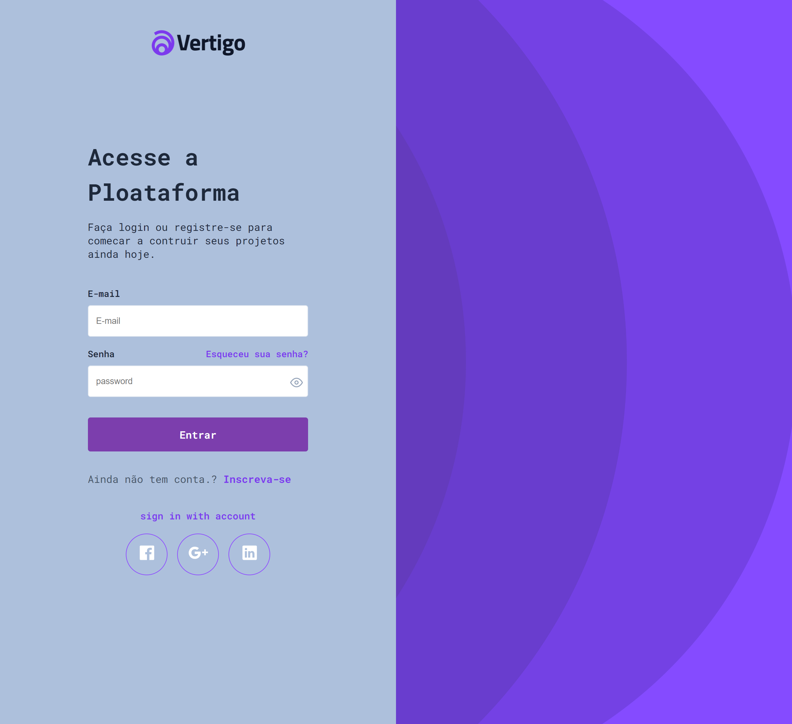

<h1 align="center"> Login Vertigo </h>

<h2> Projeto desenvolvido no desafio bora codar oferecido pela rocketseat </h2>

<h2>
<a href="#tecnologia">Tecnologias</a>&nbsp;&nbsp;&nbsp;|&nbsp;&nbsp;&nbsp;
<a href="#tecnologia">Projetos</a>&nbsp;&nbsp;&nbsp;|&nbsp;&nbsp;&nbsp;
<a href="#tecnologia">Figma</a>&nbsp;&nbsp;&nbsp;|&nbsp;&nbsp;&nbsp;
 <a href="#memo-tecnologia">licença</a>
</h2>

 

  

## 🖥️ Projeto

Projeto Tela de login Vertigo

- [📌Acesse o projeto finalizado, online](https://jeferson-3.github.io/Login_Vertigo)

 
 

## 🤖 Tecnologias

<h3>Esse projeto foi desenvolvido com as seguintes tecnologias</h3>
 

- HTML
- CSS
- JavaScript
- Git/Github

## :memo: Licença
Essa licença esta sob a licença MIT